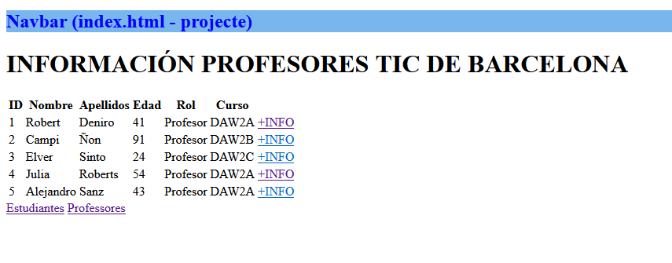
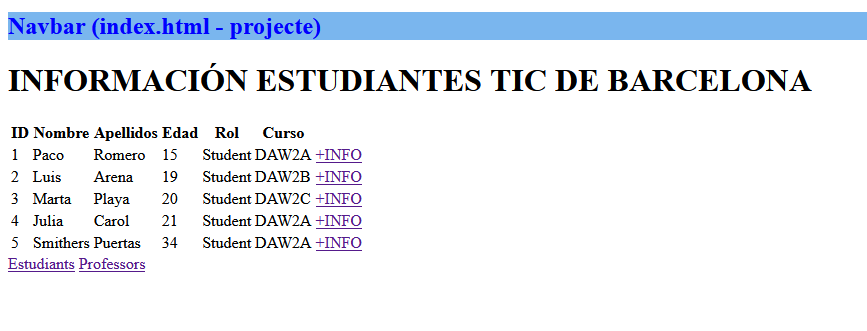

# Proyecto TIC_GestioPersonal

Enlace al vídeo: [url](https://drive.google.com/file/d/1zNz0TFClPnBHYt4eA3oA8Y5I0e3mfTUf/view?usp=drive_link)
Enlace a GitHub: [url](https://github.com/ivanmontero97/UF4_Django)

## Práctica 1

Crear un proyecto de DJANGO llamado TIC_GestioPersonal.
El nombre de la aplicación donde se agregarán los templates y las vistas es `centre`.
Se desarrollará una aplicación para mostrar datos del alumnado de DAW2B y de su profesorado.

### Datos a mostrar del alumnado:
- Nombre
- Primer apellido
- Segundo apellido
- Correo
- Curso
- Módulos matriculados

### Datos a mostrar del profesorado:
- Nombre
- Primer apellido
- Segundo apellido
- Correo
- Curso
- Tutor (si aplica)
- Módulos que imparte

### Rutas:
- Alumnado: `localhost:8000/centre/students`
- Profesorado: `localhost:8000/centre/teachers`

Solo la página principal del proyecto debe renderizar también un encabezado. Este encabezado siempre se mostrará, independientemente de si se están mostrando datos del profesorado o del alumnado.

Modificar el ejercicio 1 para que se vea como en el gif de la diapositiva 7 de TEORIA UF4 - PARÀMETRES I ENLLAÇ. Es decir, debe tener una página principal que renderice con el listado completo de profesorado o alumnado, y cada profesor/a o alumno/a tiene un enlace a una página donde solo se muestra su información. Cada página debe tener un retorno a la página principal.
